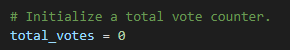
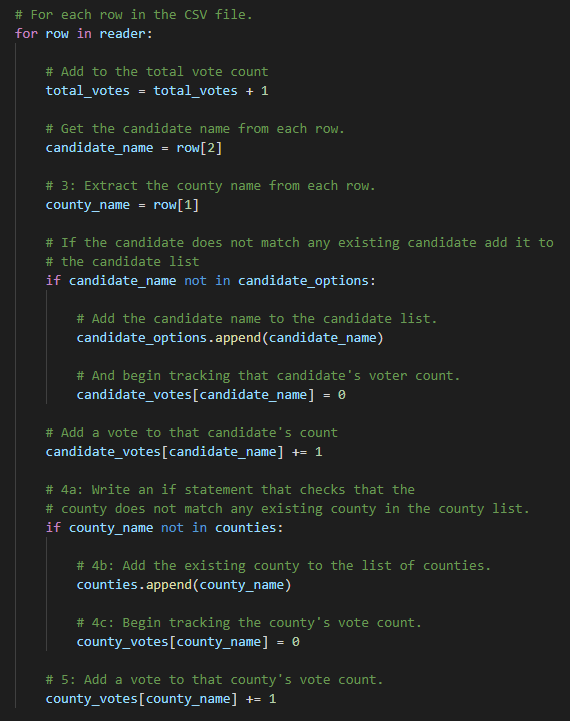
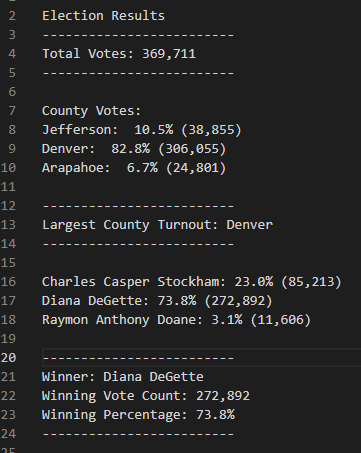

# Congressional Election Analysis

## Project Overview
Colorado Board of Elections has requested a complete audit of the recent congressional election. Using VS Code and Python, an anaylsis is ran to compile results of the election by candidate and county with a count of the votes and the percentage of votes won by each candidate or cast from each county.

### Analysis Information Requested:
1. Calculate total number of votes cast.
2. Get a complete list of candidates who received votes.
3. Calculate the total number of votes each candidate received.
4. Calculate the percentage of votes each candidate won.
5. Determine the winner of the election based on popular vote.

## Resources
Data Source: `election_results.csv`

Software: Python 3.10.2, Visual Studio Code 1.65.2

## Election Audit Results:
### The anaylsis of the election shows that:
- There were **369,711** votes cast in the election.
- Votes cast by county:
    - Jefferson cast **10.5%** of the vote and **38,855** number of votes.
    - Denver cast **82.8%** of the vote and **306,055** number of votes.
    - Arapahoe cast **6.7%** for the vote and **24,801** number of votes.
- **Denver County** had the largest amount of votes.
- The candidates were:
    - Charles Casper Stockham
    - Diana DeGette
    - Raymon Anthony Doane
- The candidate results were:
    - Charles Casper Stockham received **23.0%** of the vote and **85,213** number of votes.
    - Diana DeGette received **73.8%** of the vote and **272,892** number of votes.
    - Raymon Anthony Doane received **3.1%** of the vote and **11,606** number of votes.
- The winner of the election was:
    - **Diana DeGette**, who received **73.8%** of the vote and **272,892** number of votes.

## Coding used in Challenge:
#### To calculate the number of votes, the following code was used in a `for` loop format.

#### The Output Text File:

    
## Election Audit Summary
I propose the Election Commission can reuse the script with modifications to fit some of their other election anaylsis needs. Since the code already runs to read a `.csv` file, it is possible to use this code on another document of information. Since the code iterates through the 'County' and 'Candidate' columns, these can replaced with other columns; for example, if they wanted to run a federal election, they could sub the 'County' column with 'State' column. It could also be modified to give date and time information or ballot types (electronic, paper, etc.) and output the number of those criteria.
